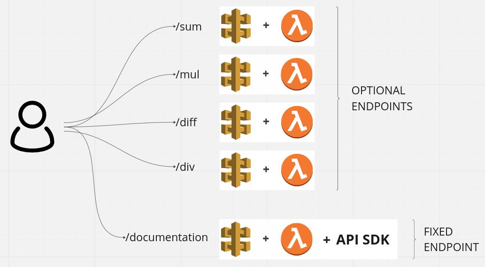

# Terraform demo

The code in this repository uses Terraform to build an API demo in AWS, whose
public endpoints perform basic arithmetic operation examples: sums, multiplications, ...

## Features

- Uniform endpoints running GET methods, where the querystring parameters (a & b) are the factors for the underlying operations.
- The exact collection of endpoints is configurable (by extending the `endpoints` array at the [configuration](src/configuration.tf) file) For this demo, we only have implemented basic arithmetic operations (sum, diff, mul and div) but you can extend the collection by providing a backend at the [assets folder](src/assets)
- An extra `documentation` endpoint. When users hit this API endpoint, they will get a newly generated version of the API's deocumentation describing the current API's configuration. This endpoint accepts a `format` querystring to allow users to decide if they want a Swagger (`swagger`) or OpenAPI (`oas30`) version of the documentation.

## Infrastructure diagram

## Requirements

- Terraform installed
- An AWS account with a infrastructure user able to create API Gateway resources and Lambda functions.
- An AWS CLI instance logged in as the infrastructure user.

## How to use it.

We implemented short versions of the native Terraform commands, thus, to set up the infrastructure and test the documentation endpoint we can just:

1. Run `make init` at the root folder.
2. Configure the API at [configuration.tf](src/configuration.tf). Where:

   - `endpoints.operation` indicates the backend for any endpoint.
   - `endpoints.description` informs about each endpoint in the API's docs.
   - `description` an API's description
   - `terms_of_service` a link to the API's terms of service
   - `contact` API's contact information
   - `license` a link to the API's license

3. Run `make apply`at the root folder
4. Hit the API's `/documentation` endpoint and check if all the details are present.
5. Just in case, clean up by running `make destroy`at the root folder.
